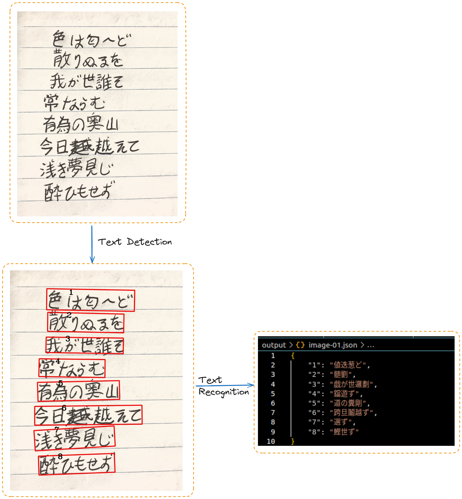

# Japanese Handwriting OCR

This is a simple Optical Character Recognition (OCR) system for Japanese handwriting using PaddleOcr for text detection and OpenVino's Japanese handwritten text recognition model.

### Prerequisites
- Python >= 3.8.0
- Pip >= 24.0

### Set Up Virtual Environment
```bash
python -m venv venv  # Replace 'venv' with your desired virtual environment name
source venv/bin/activate  # Activate the virtual environment (Linux/macOS)
venv\Scripts\activate.bat  # Activate on Windows
```

### Install Dependencies
```bash
pip install -r requirements.txt
```

### Run the Application
```bash
python main.py japanese-handwriting-images/image-01.jpeg
```
### Demo


### References
- [PaddleOcr](https://github.com/PaddlePaddle/PaddleOCR/blob/main/README_en.md)
- [Handwritten Chinese and Japanese OCR with OpenVINO](https://docs.openvino.ai/2022.3/notebooks/209-handwritten-ocr-with-output.html)
- [Image Processing in OpenCV](https://docs.opencv.org/4.x/d2/d96/tutorial_py_table_of_contents_imgproc.html)